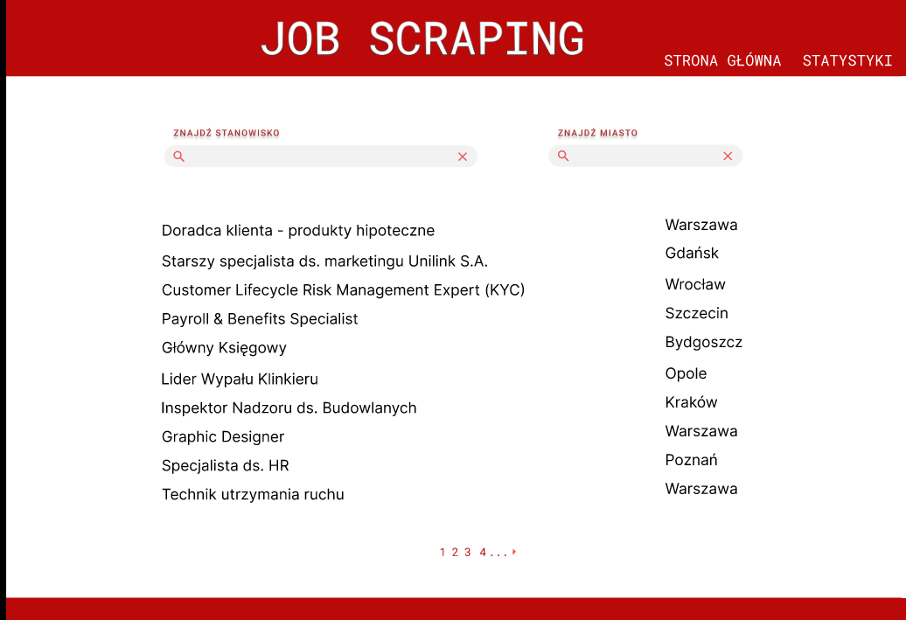
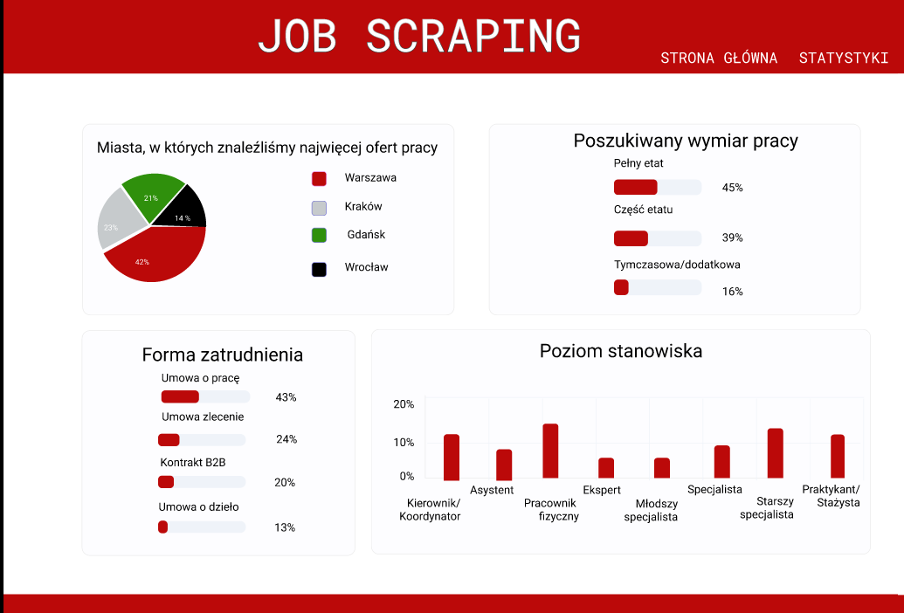
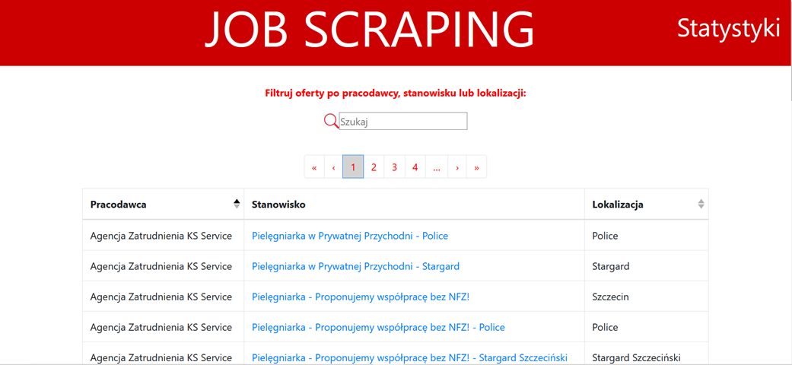
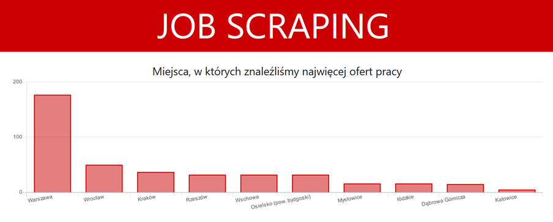
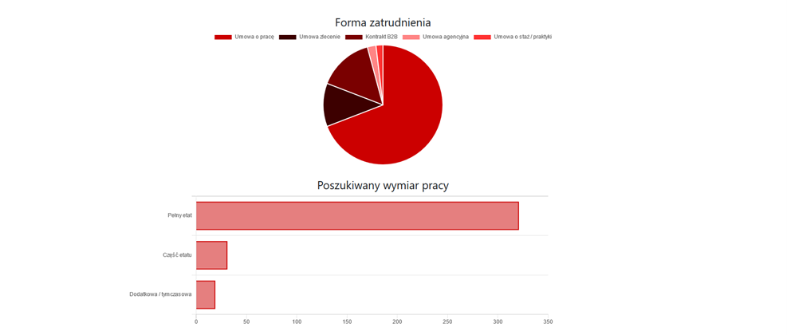

# JobScraping
JobScraping is a portal analyzing the current job market and providing you with various statistics

* [Charakterystyka oprogramowania](#1-Charakterystyka-oprogramowania)
* [Prawa autorskie](#2-Prawa-autorskie)
* [Specyfikacja wymagań](#3-Specyfikacja-wymagań)
* [Architektura systemu](#4-Architektura-systemu)
* [Architektura uruchomieniowa](#5-Architektura-uruchomieniowa)

## 1 Charakterystyka oprogramowania

Nazwa skrócona: JobScraping

Nazwa pełna: JobScraping – find your dream job and career opportunities that match your interests. 

Krótki opis: Strona internetowa umożliwiająca znalezienie interesujących nas ofert pracy. Prezentująca statystyki i trendy związane z rynkiem pracy.
 ### Prototyp aplikacji
 
 
 
  
 
  ### Aktualny postęp - w pełni działająca aplikacja (możliwa rozbudowa)
  
   
   
   
 
 

## 2 Prawa autorskie

Autorzy: Aleksandra Okrój, Mateusz Sałata, Natalia Skórowska

Licencja: Uznanie autorstwa - użycie niekomercyjne

## 3 Specyfikacja wymagań

| ID | Kategoria | Podkategoria | Nazwa krótka | Opis | Priorytet
| ------------- | ------------- |------|------|---------|--------|
| WF1  | Funkcjonalne  | Dostosowanie wyników | Wyszukiwanie | Możliwość wyszukania przez użytkownika interesujących go ofert pracy poprzez wpisanie w pasku wyszukania nazwy stanowiska, miasta lub pracodawcy | P1
| WF2  | Funkcjonalne  | Nawigacja | Paging | Możliwość przejścia do kolejnych stron z wynikami wyszukiwania jeśli ilość ofert na stronie przekracza 30 pozycji. Panel nawigacyjny znajduje się zarówno na górze jak i na dole listy wyników. | P3
| WF3 | Funkcjonalne  | Dostosowanie wyników | Sortowanie | Możliwość sortowania wyników wyszukiwania alfabetycznie według: pracodawcy, stanowiska, lokalizacji| P2
| WF4  | Funkcjonalne  | Obsługa błędów | Dedykowana strona błedu | Jeśli użytkownik będzie próbował przejść na zasoby serwera, które nie są dla niego dostępne lub, które nie istnieją zostanie wyświetlona dedykowana strona do obsługi błędu informująca użytkownika o błędzie  | P2
| WF5 | Funkcjonalne | Statystyki | Zakładka statystyki | Poprzez wybranie odpowiedniej opcji z górnego panelu nawigacyjnego po prawej stronie zatytułowanej „Statystyki” użytkownik zostaje przeniesiony do strony przedstawiającej statystyki związanych z ofertami pracy | P1
| WF6 | Funkcjonalne | Statystyki | Strona ze statystykami | Strona ze statystykami ukazuje statystyki dotyczące: miejsc z ofertami pracy, formy zatrudnienia, poszukiwanego wymiar pracy, poziomu stanowiska | P1
| WF7 | Funkcjonalne | Nawigacja | Strona główna | Po wejściu na stronę główną użytkownik widzi listę z ofertami pracy | P1
| WF8 | Funkcjonalne | Nawigacja | Aktywny link| Po kliknięciu na tytuł oferty pracy użytkownik zostaje przekierowany do strony na której znajduje się to ogłoszenie | P3
| WF9 | Funkcjonalne | Statystyki | Wykresy | Dane statystyczne przedstawione są w formie wykresów (słupkowych i kołowych) | P3
| WF10 | Funkcjonalne | Nawigacja | Powrót do strony głównej | Po kliknięciu na nazwę portalu znajdującą się na górnym panelu nawigacyjnym użytkownik zostaje przekierowany do strony głównej | P1
| WN1 | Niefunkcjonalne | Projektowe | Obsługiwane przeglądarki | Korzystanie z portalu przez użytkowników jest możliwe przy pomocy komputera z dostępem do sieci internetowej z zainstalowaną jedną z rekomendowanych przeglądarek internetowych: Google Chrome, Mozilla Firefox, Opera, Safari, Microsoft Edge. | P1
| WN2 | Niefunkcjonalne | Projektowe | Dostęp do internetu | Do działania aplikacji niezbędny jest dostęp internetu. | P1
| WN3 | Niefunkcjonalne |Projektowe | System operacyjny | Aplikacja powinna działać prawidłowo na urządzeniach zawierających system operacyjny Windows (32 bit i 64 bit), Linux i MacOs. | P1
| WN4 | Niefunkcjonalne | Projektowe | Responsywność | Interfejs aplikacji musi być responsywny, jego rozmiar, wygląd i układ dostosowuje się automatycznie do możliwości urządzenia, na którym jest wyświetlany.| P1
| WN5 | Niefunkcjonalne | Wydajnościowe | Liczba użytkowników na stronie | Jednocześnie ze strony może korzystać 500 osób znajdujących się w różnych lokalizacjach | P2
| WN6 | Niefunkcjonalne | Wydajnościowe | Czas reakcji | Maksymalny czas pomiędzy pobudzeniem przez użytkownika a odpowiedzią systemu nie powinien być dłuższy niż 4 sekundy.| P2
| WN7 | Niefunkcjonalne | Interfejs | Język polski | Interfejs Użytkownika, wszelkie komunikaty, powiadomienia, alerty przesyłane (pokazywane) Użytkownikowi muszą być prezentowane w języku polskim. | P1
| WN8 | Niefunkcjonalne | Interfejs | Prosta obsługa | Aplikacja musi  być możliwa do obsługi dla osób bez specjalistycznej wiedzy informatycznej i programistycznej, w tym umożliwiać pracę jedynie z poziomu interfejsu, bez konieczności pisania kodu. | P1
| WN9 | Niefunkcjonalne | Interfejs | Ergonomia |  Moduły funkcjonalne muszą być wyposażone w graficzny, funkcjonalny, przyjazny oraz intuicyjny interfejs Użytkownika.| P1
| WN10| Niefunkcjonalne | Jakość | Repozytorium | Wszystkie wytworzone pliki (w szczególności całość kodu źródłowego) aplikacji muszą być zapisywane w repozytorium i aktualizowane w ramach przekazywania kolejnych wersji aplikacji.| P2
| WN11 | Niefunkcjonalne | Projektowe | Pobieranie danych | Oferty pracy i dane z nimi związane pobieranie są z innych stron internetowych: infoPraca.pl, praca.pl, pracuj.pl | P1
| WN12| Niefunkcjonalne | Interfejs | Przekierowanie do oferty | Link, który przekierowuje użytkowników do konkretnej oferty pracy powinien być wyraźnie zaznaczony.| P2
| WN13| Niefunkcjonalne | Bezpieczeństwo | Pobieranie ofert | Oferty pobrane do aplikacji pochodzą z bezpiecznych i uprzednio sprawdzonych stron. | P2
| WN14 | Niefunkcjonalne | Ergonomia | Rozbudowa | Aplikacja powinna zostać napisana w taki sposób aby umożliwić ewentualną implementację kolejnych funkcjonalności lub modyfikację poszczególnych modułów w przyszłości. | P2
| WN15 | Niefunkcjonalne | Jakość | Kopie zapasowe | Aplikacja powinna posiadać kopię zapasową tak, aby istniała możliwość odtworzenia środowiska i danych (w części lub w całości). | P2
| WN16 | Niefunkcjonalne | Jakość | Dokumentacja | Do systemu powinna zostać dostarczona dedykowana dokumentacja stworzona w polskiej wersji językowej. | P3
| WN17 | Niefunkcjonalne | Jakość | Struktura | Aplikacja została stworzona zgodnie z zasadami dotyczącymi podziału kodu na mniejsze pliki oraz z zachowaniem przejrzystej struktury katalogów. | P3
| WN18 | Niefunkcjonalne | Interfejs | Spójność | Interfejsy i elementy aplikacji są estetyczne i spójne ze sobą | P2
| WN19 | Niefunkcjonalne | Interfejs | Nazwa portalu | Nazwa portalu została umieszczona na środku górnego panelu apikacji | P1
| WN20 | Niefunkcjonalne | Interfejs | Stopka | Na końcu każdej strony umieszczona została stopka, na której widnieją imiona i nazwiska twórców aplikacji | P3

## 4 Architektura systemu

| Lp. | Nazwa produktu | Przeznaczenie w projekcie | Wersja |
| ------------- | ------------- |------|------|
|1| Python |Backend aplikacj| 3.9.2 (19.02.2021)|
|2| Beautiful Soup | Scraping ofert pracy | 4.9.3 (03.10.2020)|
|3| Pandas | Analiza danych dotyczących ofert pracy i tworzenie na ich podstawie statystyk | 1.2.3 (02.03.2021)|
|4| Flask | Backend aplikacji |1.1.2 (03.04.2020) |
|5| Cors | Umożliwienie bezpiecznej wymiany danych pomiędzy stronami, z których pobierane są dane o ofertach pracy|3.0.10 (06.01.2021) |
|6| HTML5 | Struktura aplikacji | 1.4938 (01.11.2016) |
|7| Vue | Tworzenie dynamicznych interfejsów użytkownika| 2.9.6 |
|8| Bootstrap | Wygląd interfejsów użytkownika aplikacji| 4.6.0 (19.01.2021) |
|9| Axios | Komunikacja z API | 0.21.1 (21.12.2020) |
|10| Chartkick | Wykresy ukazujące dane statystyczne | 4.0.2 (2021-04-06)| 
|11| Figma | Stworzenie prototypu aplikacji | - |

## 5 Architektura uruchomieniowa

| Lp. | Nazwa produktu | Przeznaczenie w projekcie | Wersja |
| ------------- | ------------- |------|------|
|1| Visual Studio Code | IDE używane przy tworzeniu projektu| 1.55.0 (30.03 2021)|
|2| Windows 10 | System operacyjny, na którym stworzona została aplikacja| 20H2 19042.867(03.09.2020)|
|3| Google Chrome | Przeglądarka, w której uruchamiana jest aplikacja| 89.0.4389.114 (03.03.2021)|
|4| Git | System kontroli wersji | 2.31.1 (26.03.2021) |
|5| GitHub | Serwis na którym zamieszczone zostało repozytorium z aplikacją | 3.26.2 |

